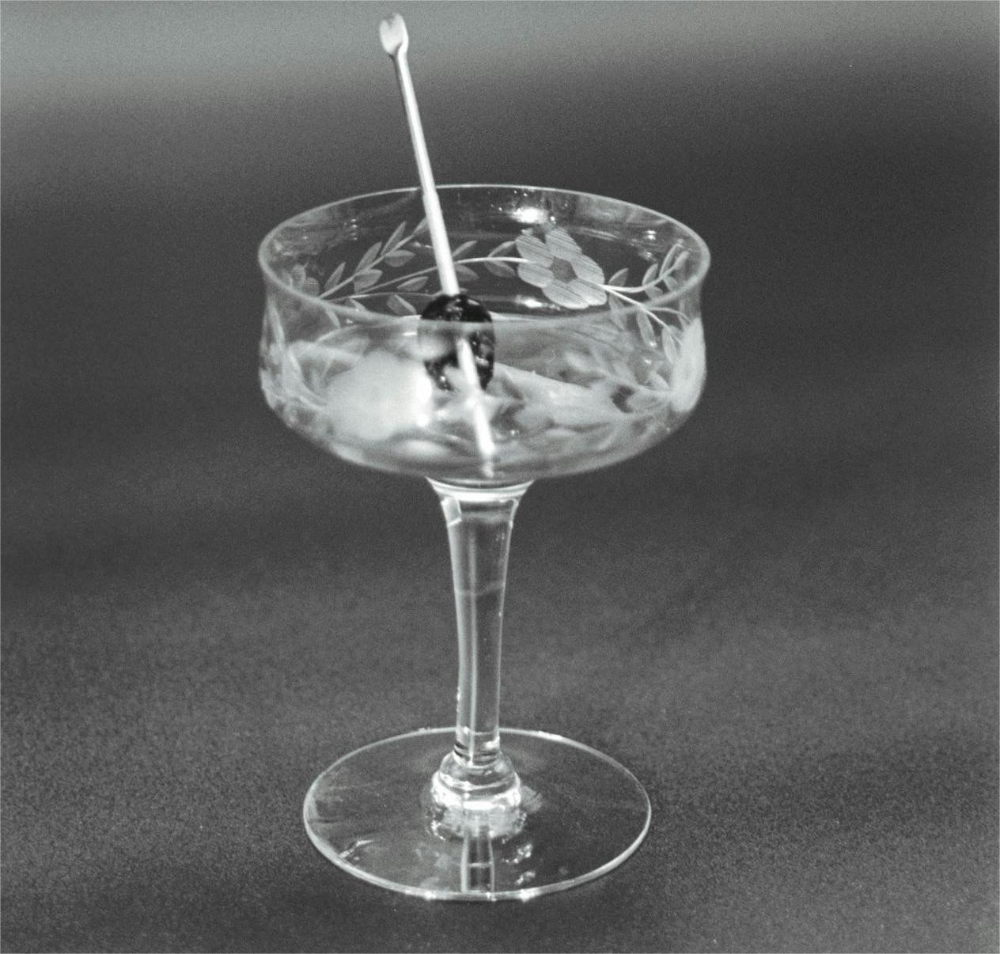
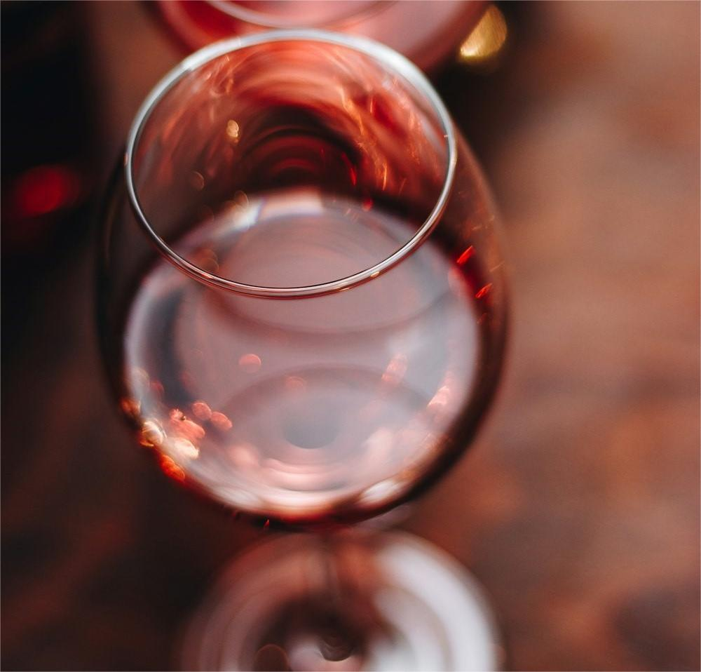
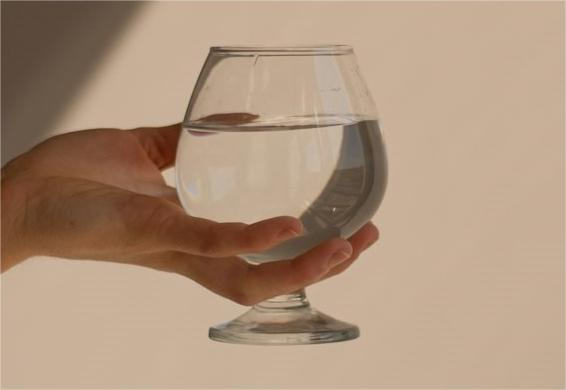
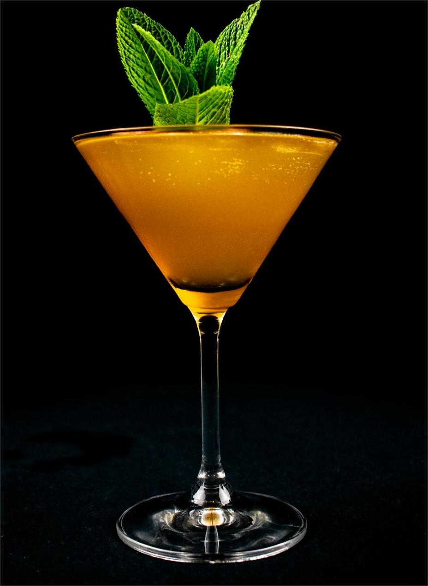

 <!-- 产品介绍 -->

    

        <h1 class="display-4">玻璃杯产品介绍</h1>
        
探索我们精美的玻璃杯系列，满足您的不同需求和品味。

    

    <!-- 产品1 -->
    

        

            
        

        

            <h2>古典杯(old-fashioned)</h2>
            
又被称为威士忌杯、“岩石杯”。此杯壁较厚、杯底厚实，杯体宽大，令持杯者感到稳重、豪爽。威士忌杯是专门用于饮用威士忌的玻璃酒杯，其特点为圆桶型设计，杯底厚实，以适应加冰的需求。玻璃杯则是由玻璃制成的杯子，具有环保、健康、易清洗等优点，常用于日常饮水和品酒。威士忌杯作为玻璃杯的一种，专为威士忌爱好者设计，提供了独特的品酒体验。

            
<strong>价格：</strong> ¥20

            <a href="#" class="btn btn-primary">购买</a>
        

    

    <!-- 产品2 -->
    

        

            
        

        

            <h2>香槟杯(champagne glass)</h2>
            
用于盛香槟酒或起泡葡萄酒，也作为鸡尾酒的载杯，分成三种类型：浅碟型、笛型、郁金香型，后两者多用于酒吧或宴会。香槟杯是专为香槟酒设计的玻璃杯，特点为细长杯身和窄口，有助于保留香槟的气泡和香气。玻璃杯是通用容器，适用于多种饮品，而香槟杯则是玻璃杯中的一种特殊类型，用于提升香槟的品鉴体验。

            
<strong>价格：</strong> ¥35

            <a href="#" class="btn btn-primary">购买</a>
        

    

    <!-- 产品3 -->
    

        

            
        

        

            <h2>红葡萄酒杯(red wine glass)</h2>
            
用于盛各类红葡萄酒，以容量10-12盎司较适宜，其杯型有球型、布根地型、波尔多型等。红葡萄酒杯是专为红葡萄酒设计的玻璃杯，杯肚圆润宽大，杯口略开，有助于氧化和释放葡萄酒的香气。其设计不仅考虑到了葡萄酒的品质，也提升了饮酒的舒适度和感官体验。红葡萄酒杯是品鉴红葡萄酒时不可或缺的器具。

            
<strong>价格：</strong> ¥50

            <a href="#" class="btn btn-primary">购买</a>
        

    

    <!-- 产品4 -->
    

        

            
        

        

            <h2>海波杯(highball glass)</h2>
            
一种平底高身直筒型杯，多用于盛载长饮类鸡尾酒，亦可用于盛鲜果汁饮料，非常美观。常用于盛载长饮类鸡尾酒或软饮料。其杯型圆润，容量适中，多为224ml（盎司），能够快速醒酒并保留酒体香气。适用于内容丰富、颜值高的鸡尾酒，是品酒爱好者的优选之一。

            
<strong>价格：</strong> ¥50

            <a href="#" class="btn btn-primary">购买</a>
        

    

    <!-- 产品5 -->
    

        

            
        

        

            <h2>鸡尾酒杯(cocktail glass)</h2>
            
又叫“马天尼杯”，是V型带有柄的玻璃杯，容量约100毫升，形状独特，常用于装马天尼鸡尾酒。其细长的杯脚设计方便持杯，不会让鸡尾酒的温度上升，杯身的锥形则使芬芳气味更容易扩散，是调制和品饮马天尼鸡尾酒的理想选择。用于鸡尾酒，是酒吧或家庭小酒柜必备的杯具，以容量为41/2盎司最为适宜。

            
<strong>价格：</strong> ¥50

            <a href="#" class="btn btn-primary">购买</a>
        

    

